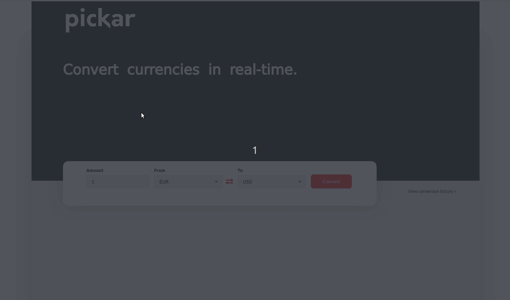

## Live Currency Converter

<a href="https://currency-converter-react.netlify.app/" target="_blank"><h3 align="left">Click here for demo</h3></a>

## Table of Contents

- [General info](#general-info)
- [Preview](#preview)
- [Technologies](#technologies)
- [Contact](#contact)

## General Info

Live currency converter built with React. Gives you opportunity to do conversion between `EUR`,`USD`and `CHF` with the provided amount. Thanks to the external API, you can get real live rates. The result of each conversion is displayed to the user while the history is saved. If clicked on `View conversion history`, user can also see the full history of the conversions that has been made. Feel free to try it out!

## Preview

## Technologies

- HTML
- CSS
- Javascript
- React
- React-router
- Semantic-Ui

## Contact

Created by [eminaydin](https://github.com/eminaydin) - feel free to contact me for any inquiries!
